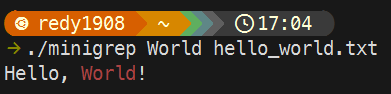

# A (lot) simple implementation of the *grep* command in Rust

Returns the lines that contains the *query*

## Build

```sh
cd minigrep
cargo build
```

## Usage

```sh
./minigrep {query} {file}
```

## Example

Given a file `test.txt` with the following line: `Hello, World!` we, for example, can search for the word: `Hello`: 



Minigrep by default will use case sensitive matching, you can enable case insensitive matching with the param `-i` (ignore case).

Minigrep can also dysplay the line numbers, use the param `-n`.
