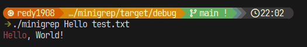

# A (a lot) simple implementation of the command *grep* in Rust

Returns the lines that contains the *query*

## Build

```sh
cd minigrep
cargo build
```

## Usage

```sh
./minigrep {query} {file}
```

## Example

Given a file `hello_world.txt` with the following line: `Hello, World!` we, for example, can search for the word: `World`: 



Case insensitive:


